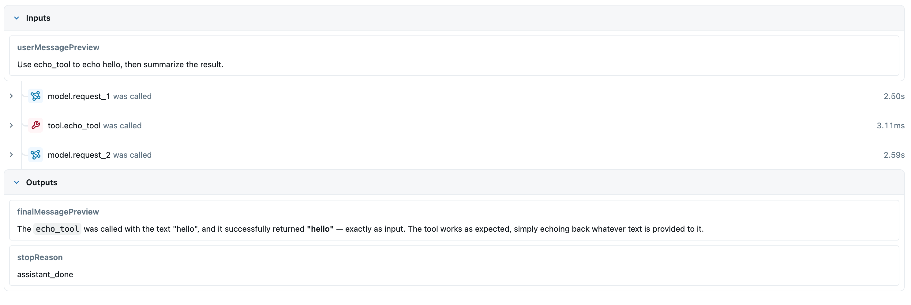

# MLflow Tracing

## 目标

Lesson 1.3 开始使用 MLflow 观察 Agent Loop 运行过程。目标不是引入一套复杂 telemetry 平台，而是先让一次 agent run 可以在本地 MLflow UI 里看到：

- `agent.run` root span。
- `context.build` span。
- `model.request` span。
- `tool.<name>` span。
- stop reason、usage、tool filtering metrics。
- root span 的 run metrics，例如 context build 次数、model request 次数、tool call 次数。

## 本地启动

项目根目录提供 `docker-compose.yml`：

```bash
docker compose up -d mlflow
```

MLflow UI：

```text
http://127.0.0.1:5001
```

端口说明：

- 容器内 MLflow 使用 `5000`。
- 本机映射到 `5001`，避免和 macOS 本机已有 `5000` 监听进程冲突。

## Floris 接入方式

Floris runtime 不把 MLflow 类型写进 Agent Loop 主 contract。接入分三层：

```text
AgentLoop
  -> TraceRecorder interface
  -> MlflowTraceRecorder
  -> mlflow-tracing SDK
  -> local MLflow server
```

关键文件：

- `packages/agent-runtime/src/types/trace.type.ts`
- `packages/agent-runtime/src/trace/mlflow-trace-recorder.ts`
- `packages/agent-runtime/src/core/agent-loop-trace.ts`
- `packages/agent-runtime/src/core/agent-loop.ts`
- `packages/agent-runtime/src/demo/run-demo.ts`

Prompt / Agent version 的 MLflow 接入设计见 `docs/architecture/mlflow-prompt-and-agent-versioning.md`。

## 运行 demo

先启动 MLflow，再运行：

```bash
cd packages/agent-runtime
MLFLOW_TRACKING_URI=http://127.0.0.1:5001 MLFLOW_EXPERIMENT_ID=0 bun run demo --example echo
```

`run-demo.ts` 默认创建 `MlflowTraceRecorder`，不需要额外传 trace 参数。

成功信号：

- demo 最终 `stopReason` 为 `assistant_done`。
- MLflow logs 里出现：
  - `POST /api/3.0/mlflow/traces`
  - `PUT /api/2.0/mlflow-artifacts/artifacts/.../traces.json`
- MLflow UI 的 Traces 页面能看到新 trace。

也可以查询最近 trace：

```bash
curl -s "http://127.0.0.1:5001/ajax-api/2.0/mlflow/traces?experiment_ids=0&order_by=timestamp_ms%20DESC&max_results=3&filter="
```

## 当前边界

当前只接入 MLflow TypeScript SDK，不引入 OpenTelemetry 设计。

trace 中只记录 preview 和 metrics：

- user message preview。
- final message preview、tail preview 和 final message length。
- context token estimate。
- model span inputs：`systemPreview`、`messagesPreview`、`toolNames`、`maxOutputTokens`。
- model span outputs：`textPreview`、`textTailPreview`、`textLength`、`toolCallsPreview`、stop reason、usage。
- provider event counts。
- root usage：`floris.usage.input_tokens`、`floris.usage.output_tokens`、`floris.usage.total_tokens`。
- model usage：`floris.provider.usage.input_tokens`、`floris.provider.usage.output_tokens`、`floris.provider.usage.total_tokens`。
- run metrics：`floris.metrics.context_build_count`、`floris.metrics.model_request_count`、`floris.metrics.tool_call_count`。
- tool name、tool call id。
- tool raw tokens、context tokens、reduction ratio、truncated。

不记录：

- API key。
- credential。
- provider 完整 request。
- tool 完整 raw output。

完整 tool output 仍然通过 Floris 的 artifact / `rawRef` 机制管理。

model preview 会做基础 redaction，例如 `api_key=...`、`token=...`、`Bearer ...` 会显示为 `[redacted]`。trace 用于开发观察，不作为 secret 存储。

## Stop Reason 观察

trace `tr-ef0b30f3157c3606a8dbe3b6a7813954` 暴露了一个关键问题：`analyze-case` 不是被 `maxIterations` 卡住，而是 provider 在第 16 次 model request 返回了 `max_tokens`，并且没有返回 tool call。旧逻辑把“没有 tool call”直接当成 `assistant_done`，导致 UI 看到的是正常结束，但实际 final answer 已经被模型输出上限截断。

当前修正：

- provider 返回 `max_tokens` 且没有 tool call 时，Agent Loop 返回 `provider_max_tokens`。
- root span 输出 `usage` 和 `metrics`，不用只靠 terminal summary 统计总 token。
- 每个 `model.request` span 写入本次 provider usage，方便定位是哪一次请求消耗或截断。
- 达到 `maxIterations` 时，默认追加一次 no-tool final synthesis request，让 agent 基于已有 observation 交付一个简短结论；如果这次 synthesis 也被 `max_tokens` 截断，则返回 `provider_max_tokens`。
- 默认 output budget 不按 demo case 特判：普通 provider request 默认 `4096`，final synthesis request 覆盖到 `8192`，并写入 `floris.model.max_output_tokens`。

trace `tr-2d7c45c1740b39d826100e50cd7ce383` 暴露了第二个问题：root span 是 `assistant_done`，但关键源码 `FetchEntity.ts` 被 `read_file` 读到后降级成 10 token summary，agent 没有足够源码上下文完成任务。当前修正：

- 默认 tool context budget 提到 `1600`。
- `read_file` 超预算时保留真实源码 excerpt，不降级成纯 summary。
- tool span 里的 `floris.tool.context_tokens` 和 `floris.tool.truncated` 用来判断是否因为 context budget 丢失了关键信息。

## 已验证

本地已验证：

```bash
cd packages/agent-runtime
bun run typecheck
bun run test
bun run check
```

MLflow trace demo 已跑通，MLflow API 返回最新 trace：

```text
tr-cebb4279ac37e390155c2be6b0ed806c
```

该 trace status 为 `OK`。

## Echo Demo 实际 Trace

运行命令：

```bash
cd packages/agent-runtime
MLFLOW_TRACKING_URI=http://127.0.0.1:5001 MLFLOW_EXPERIMENT_ID=0 bun run demo --example echo
```

MLflow trace 基本信息：

```text
trace id: tr-cebb4279ac37e390155c2be6b0ed806c
experiment id: 0
status: OK
execution time: 6357ms
```

MLflow UI 中的 Inputs：



```text
userMessagePreview:
Use echo_tool to echo hello, then summarize the result.
```

MLflow UI 中的 span 顺序：

```text
model.request_1 was called    2.50s
tool.echo_tool was called     3.11ms
model.request_2 was called    2.59s
```

MLflow UI 中的 Outputs：

```text
finalMessagePreview:
The echo_tool was called with the text "hello", and it successfully returned "hello" — exactly as input. The tool works as expected, simply echoing back whatever text is provided to it.

stopReason:
assistant_done
```

同一次 demo 的 terminal summary：

```text
stopReason: assistant_done
usage:
  inputTokens: 685
  outputTokens: 86
  totalTokens: 771

toolCallSequence:
  iteration: 0
  name: echo_tool
  input:
    text: hello

toolOutputFiltering:
  domainFilter: echo-domain-filter
  strategy: structure_only
  rawTokens: 2
  contextTokens: 2
  reductionRatio: 1
  truncated: false
```

这说明默认 demo 已完成完整 loop：

```text
user message
  -> model request 1
  -> echo_tool
  -> model request 2
  -> assistant_done
```
