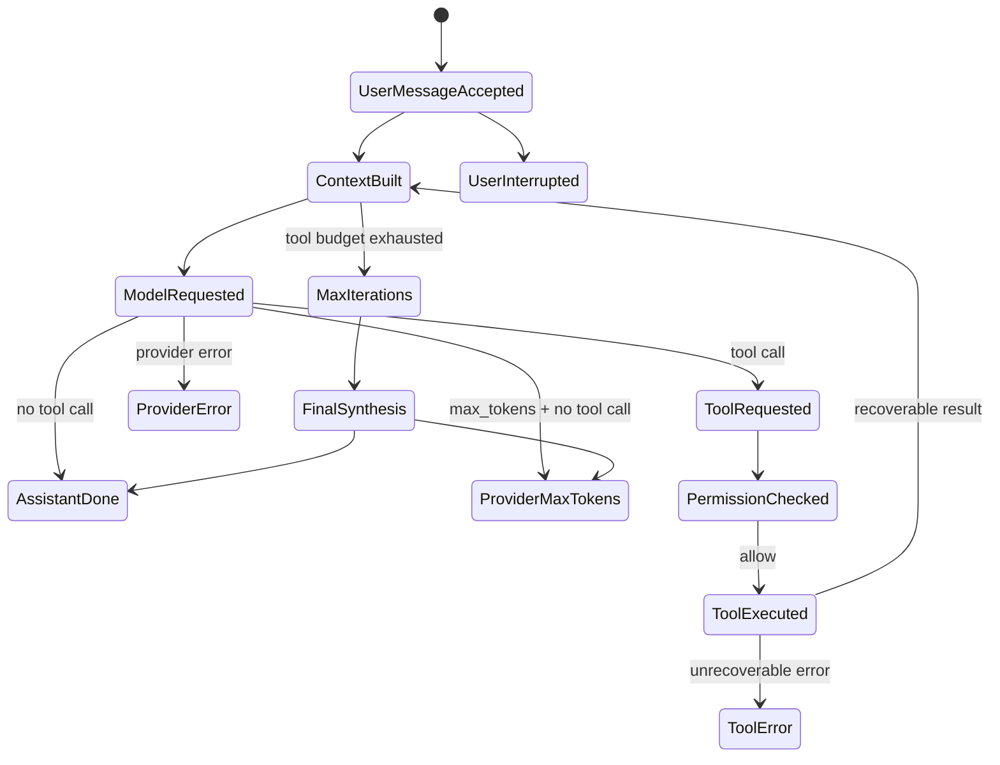

# Lesson 1.5 AgentLoop State Machine

## 目标

Lesson 1.5 实现一轮 user message 到 final answer 的最小闭环，并把 provider、tool registry、context builder、session store、permission gate 串成清晰状态机。

当前代码已经有 basic call path，用于支撑 demo；完整状态机仍要继续补。

## 当前状态

状态：implemented in `lesson-1.5-agent-loop-state-machine`

当前已经跑通：

- append user message event。
- build minimal context。
- provider request。
- consume provider events。
- 执行一次 tool call。
- tool result 回填到下一轮 provider request。
- 根据 stop reason 结束。
- 写入 MLflow trace。
- 从 session events 派生 `RunGraph` nodes / edges / metrics / diagnostics。
- 用 diagnostics 检查缺失 stop、tool 无 permission、provider max_tokens stop 不匹配等异常。

## 关键文件

- `packages/agent-runtime/src/core/agent-loop.ts`
- `packages/agent-runtime/src/core/agent-loop-trace.ts`
- `packages/agent-runtime/src/types/runtime.type.ts`
- `packages/agent-runtime/tests/agent-loop.test.ts`

## 数据流

```text
runTurn()
  -> append user_message event
  -> contextBuilder.build()
  -> provider.createMessage()
  -> consume ModelEvent
  -> execute tool if needed
  -> append tool result message
  -> provider.createMessage()
  -> stop
```

## State Machine 解决什么

这里的 state machine 不是为了引入复杂框架，也不是把代码改成 XState 这类 workflow engine。它的作用是把 agent loop 的控制流变成清楚、可测试、可回放的 runtime contract。

当前代码里已经有不少 state，例如 `iteration`、`messages`、`toolResultsForContext`、`finalMessage`、`usage`、provider stop reason 和最终 `RunTurnResult.stopReason`。这些是运行时变量，负责让一次 run 跑起来。

Lesson 1.5 要补强的是另一层：哪些阶段存在、哪些 transition 合法、什么情况下进入 tool execution、什么情况下停止、什么情况下必须返回错误或中断。这一层不应该只藏在 `for` loop 和 `if` 分支里，否则后续接入 HookRunner、PermissionGate、branch replay、UI stream 时，读者很难判断某个行为是有意设计，还是当前实现碰巧这样跑。

第一版 state machine 要回答的问题：

- 当前 run 到了哪一步。
- provider output 如何转成 runtime stop reason。
- `tool_use` 为什么只是中间 transition，不是最终成功状态。
- `maxIterations` 和 provider `max_tokens` 为什么是两种不同边界。
- permission、tool execution、tool result 回填的顺序是否固定。
- 哪些 event 必须写入 session，方便后续 replay 和 UI timeline。

### 第一版可视化和 RunGraph

Lesson 1.5 需要两层可视化：

- 文档里的 Mermaid 图：表达设计时的合法路径，方便教学、review 和测试设计。
- 运行时 `RunGraph` JSON：从真实 session events 派生，给 Lesson 1.6 的 Web UI / React Flow viewer 使用，观察一次 run 实际走到了哪里、哪里异常、哪里可以优化。

Mermaid 图用于表达当前控制流：



这张图是设计图，不是调试结果。它用于解释合法路径、指导测试 case 和后续实现，不替代代码里的类型、session event、RunGraph 或 MLflow trace。

运行时可视化不能只停留在文档。第一版应从 `AgentEvent[]` 派生一个 `RunGraph`，让开发者可以对比“设计上应该怎么走”和“这次真实 run 怎么走”：

```ts
interface RunGraph {
  schemaVersion: 1;
  runId: string;
  threadId: string;
  branchId: string;
  startedAt: string;
  endedAt?: string;
  stopReason?: LoopStopReason;
  nodes: RunGraphNode[];
  edges: RunGraphEdge[];
  metrics: RunGraphMetrics;
  diagnostics: RunGraphDiagnostic[];
}
```

`RunGraph` 是观察视图，不是唯一事实来源。事实来源仍然是 session event。这样后续可以换 React Flow、Canvas、Mermaid 或 macOS native graph view，而不改变 runtime event contract。

推荐节点类型：

- `user_message`
- `context_build`
- `model_request`
- `provider_event`
- `permission`
- `tool_call`
- `tool_result`
- `final_synthesis`
- `stop`

推荐 edge 类型：

- `transition`：主流程阶段跳转。
- `caused_by`：某个 event 由前一个 event 触发，例如 tool result 来自 tool call。
- `contains`：model request 包含 provider event，tool call 包含 permission / result。

第一版 `diagnostics` 用来暴露状态异常：

- `invalid_transition`
- `missing_stop`
- `tool_without_permission`
- `permission_denied_but_tool_executed`
- `repeated_tool_call`
- `provider_max_tokens_without_explicit_stop`
- `context_budget_high`
- `unlinked_event`

这些诊断是 RunGraph 的核心价值。它不只是把流程画出来，还要帮助我们发现 state machine 设计或实现中的问题。

## 参考项目对比

### Pi Coding Agent

Pi 的启发是：session 是可恢复的事件 / entry 记录，不只是最终消息列表。Pi session 使用 JSONL，每行是带 `type` 的对象，并通过 `id` / `parentId` 表达树状结构，支持分支和从当前 leaf 构建 context。它的 RPC event 也以 lifecycle 为中心，例如 `agent_start`、`turn_start`、`message_update`、`tool_execution_start`、`tool_execution_end`。

参考：

- https://pi.dev/docs/latest/session-format
- https://pi.dev/docs/latest/rpc

Floris 应该吸收的是：稳定 session event 是主线，branch / replay / context build 都从这条主线派生。RunGraph 也应该从 session event 派生，而不是另起一套事实格式。

### OpenCode

OpenCode 的做法更偏工程分层：agent 有 `steps` 限制；不同 agent 通过 permission 控制 read、edit、bash 等能力；plugin hooks 可以观察或介入 tool execution、permission、session status。它没有把这些都塞进一个大 FSM，而是把 step budget、permission、hooks、session event 分层处理。

参考：

- https://opencode.ai/docs/agents/
- https://opencode.ai/docs/permissions/
- https://opencode.ai/docs/plugins/

Floris 应该吸收的是：`maxIterations`、PermissionGate、HookRunner、session event 不要混成一个大状态对象。Loop lifecycle 只处理 agent loop 的合法推进；tool scope 和 permission 仍由独立模块负责。

### Statewright

Statewright 更像 workflow guardrail。它用 state machine 控制不同 phase 能使用哪些 tools，例如 planning 阶段只读、implementing 阶段开放 edit、testing 阶段只允许测试命令。它的重点是 per-state tool enforcement、command allow-list、edit guard 和 transition audit。

参考：

- https://github.com/statewright/statewright
- https://statewright.ai/research

Floris 后续可以参考 Statewright 设计 `WorkflowPolicy` 或 adapter，但 Lesson 1.5 不直接接入 Statewright。原因是 Lesson 1.5 解决的是 agent loop 内部控制流，不是 workflow phase guardrail。过早接外部 engine 会让 runtime contract 绑定到 coding workflow。

综合判断：

```text
Pi
  -> session event / tree 是事实主线
OpenCode
  -> step budget、permission、hooks 分层处理
Statewright
  -> workflow phase guardrail 后续可参考
Floris Lesson 1.5
  -> session event + loop lifecycle reducer + RunGraph diagnostics
```

## Stop Reasons

当前 stop reasons：

- `assistant_done`
- `max_iterations`
- `provider_error`
- `provider_max_tokens`
- `user_interrupted`
- `tool_error`

`tool_use` 是 provider request 的中间状态，不是 `RunTurnResult` 的最终成功状态。

## `maxIterations` 和 Provider Output Budget

`maxIterations` 是 agent loop 的 tool round budget；provider `max_tokens` 是单次 model response 的输出上限。两者不能混在一起处理。

当前策略：

- provider 返回 `max_tokens` 且没有 tool call 时，loop 返回 `provider_max_tokens`。
- 达到 `maxIterations` 时，默认追加一次 no-tool final synthesis request。
- 普通 provider request 默认 `4096` output tokens。
- final synthesis request 覆盖到 `8192` output tokens。

## MLflow Trace 证明了什么

MLflow trace 可以看到：

- `agent.run` root span。
- `context.build` span。
- `model.request` span。
- `tool.<name>` span。
- stop reason、总 usage、model request 次数、tool call 次数。
- 每个 model span 的 message preview、response preview 和单次 provider usage。

State machine 可视化和 MLflow trace 的边界不同：

- State machine 图描述“允许怎么走”，是设计 contract。
- MLflow trace 记录“这一次实际怎么走”，是 debug 和 observability 工具。
- Session event 记录“产品需要保存和回放的事实”，后续给 thread timeline、replay、branch 和 audit 使用。
- RunGraph 从 session event 派生，负责把一次真实 run 的控制流画出来，并标出异常 transition。

因此 MLflow 可以证明某个真实 run 发生了什么，但不能替代 state machine contract。反过来，state machine 图能说明合法路径，但不能告诉我们某次 provider request 的 token usage、tool output budget 或 response preview。RunGraph 处在两者之间：它关注控制流和异常状态，必要时通过 `traceSpanId` 跳到 MLflow 看细节。

`tr-ef0b30f3157c3606a8dbe3b6a7813954` 说明过一个真实问题：`analyze-case` 并不是简单超过 `maxIterations`，而是 provider 返回 `max_tokens` 且没有 tool call。Agent Loop 因此需要返回 `provider_max_tokens`，不能把截断回答当成正常结束。

`tr-2d7c45c1740b39d826100e50cd7ce383` 说明另一个问题：tool output budget 会影响 agent 判断。`read_file` 已经读到文件，但 context policy 把源码压成过短 summary，会让 agent 误以为核心文件没有读到。

当前修正：

- 默认 tool context budget 提到 `1600`。
- `read_file` 超过 budget 时保留源码 excerpt。
- 其他 tool 仍可按 summary 策略降级，避免命令日志污染 context。

## 后续路线

推荐路线：

```text
Lesson 1.5
  -> 用 typed stop reason + session event + Mermaid 图讲清楚 agent loop state machine
  -> 从 session event 派生 RunGraph JSON 和 diagnostics
Lesson 1.6
  -> 用 React Flow 展示运行时 state graph
Lesson 2.7 / 2.8
  -> 做 Floris 原生 tool scope control 和 safe execution protocol
Lesson 5+
  -> 评估 WorkflowPolicy / Statewright adapter，不让 core runtime 直接依赖外部 engine
```

也就是说，Lesson 1.5 先把“这次 run 怎么合法前进”讲清楚，并输出可派生运行图的数据基础；per-state tool enforcement 放到 tool scope、permission 和 workflow policy 层继续设计。

## 当前简化

- HookRunner 还没有接入。
- PermissionGate 还没有真实策略。
- 没有 branch tree。
- 没有真实 persistence。Lesson 1.5 只把 `SessionStore` 接进 agent loop，负责写入内存 event sequence；JSONL / SQLite 这类 durable session persistence 放到 Lesson 3 的 Persistent Work Graph。
- Stop hook 还不能阻止停止。

## 验收标准

- provider 只返回 text 时，loop 以 `assistant_done` 结束。
- provider 先返回 tool call 再返回 text 时，loop 正常结束。
- provider 连续请求 tool 达到 `maxIterations` 后，会做 final synthesis。
- provider 返回 `max_tokens` 且没有 tool call 时，loop 返回 `provider_max_tokens`。
- abort 后停止，reason 是 `user_interrupted`。
- `buildRunGraph()` 可以从 session events 派生 nodes / edges / metrics。
- `validateRunGraph()` 可以发现缺失 stop、tool 无 permission、provider max_tokens 处理异常。
- trace 中能看到 context、model、tool span 和 usage。

## 验证命令

```bash
cd packages/agent-runtime
bun run check
bun run typecheck
bun test
```
